<style>
  /*!
  Theme: GitHub Dark Dimmed
  Description: Dark dimmed theme as seen on github.com
  Author: github.com
  Maintainer: @Hirse
  Updated: 2021-05-15

  Colors taken from GitHub's CSS
*/

.hljs {
  color: #adbac7;
  background: #22272e;
}

.hljs-doctag,
.hljs-keyword,
.hljs-meta .hljs-keyword,
.hljs-template-tag,
.hljs-template-variable,
.hljs-type,
.hljs-variable.language_ {
  /* prettylights-syntax-keyword */
  color: #f47067;
}

.hljs-title,
.hljs-title.class_,
.hljs-title.class_.inherited__,
.hljs-title.function_ {
  /* prettylights-syntax-entity */
  color: #dcbdfb;
}

.hljs-attr,
.hljs-attribute,
.hljs-literal,
.hljs-meta,
.hljs-number,
.hljs-operator,
.hljs-variable,
.hljs-selector-attr,
.hljs-selector-class,
.hljs-selector-id {
  /* prettylights-syntax-constant */
  color: #6cb6ff;
}

.hljs-regexp,
.hljs-string,
.hljs-meta .hljs-string {
  /* prettylights-syntax-string */
  color: #96d0ff;
}

.hljs-built_in,
.hljs-symbol {
  /* prettylights-syntax-variable */
  color: #f69d50;
}

.hljs-comment,
.hljs-code,
.hljs-formula {
  /* prettylights-syntax-comment */
  color: #768390;
}

.hljs-name,
.hljs-quote,
.hljs-selector-tag,
.hljs-selector-pseudo {
  /* prettylights-syntax-entity-tag */
  color: #8ddb8c;
}

.hljs-subst {
  /* prettylights-syntax-storage-modifier-import */
  color: #adbac7;
}

.hljs-section {
  /* prettylights-syntax-markup-heading */
  color: #316dca;
  font-weight: bold;
}

.hljs-bullet {
  /* prettylights-syntax-markup-list */
  color: #eac55f;
}

.hljs-emphasis {
  /* prettylights-syntax-markup-italic */
  color: #adbac7;
  font-style: italic;
}

.hljs-strong {
  /* prettylights-syntax-markup-bold */
  color: #adbac7;
  font-weight: bold;
}

.hljs-addition {
  /* prettylights-syntax-markup-inserted */
  color: #b4f1b4;
  background-color: #1b4721;
}

.hljs-deletion {
  /* prettylights-syntax-markup-deleted */
  color: #ffd8d3;
  background-color: #78191b;
}

.hljs-char.escape_,
.hljs-link,
.hljs-params,
.hljs-property,
.hljs-punctuation,
.hljs-tag {
  /* purposely ignored */
}

/*MY STYLE*/

h1, strong {
  color: #F96743 !important;
}
</style>


# **SvelteKit**

Frontend & Backend framework

<span style="color:#101417;">Patrik Mintěl</span>

---

# Terminology

-   Frontend
-   Backend
-   Framework
-   Router

---

# Frontend

-   HTML
-   CSS
-   JavaScript

---

# HTML

```HTML
<!DOCTYPE html>
<html lang="en">
<head>
    <meta charset="UTF-8">
    <title>My first page</title>
</head>
<body>
    <h1>Hello</h1>
    <p>Some text</p>
</body>
</html>
```

---

# HTML


---

# CSS

```CSS
h1 {
  color: blue;
}

p {
  background-color: pink;
  color: black;
}
```

---

# CSS


---

# JavaScript

```HTML
<!DOCTYPE html>
<html lang="en">
    <head>
        <meta charset="UTF-8" />
        <meta name="viewport" content="width=device-width, initial-scale=1.0" />
        <title>Document</title>
    </head>
    <body>
        <span>0</span>
        <button>Add</button>

        <script>
            let counter = 0;

            const span = document.querySelector('span');

            document.querySelector('button')?.addEventListener('click', () => {
                counter++;
                span.textContent = counter;
            });
        </script>
    </body>
</html>
```

---

# JavaScript


---

# Backend

-   Typically part of the website, which you don't see
-   Handles authentication etc..
-   Can be written in C#, Java, PHP, Javascript (NodeJS)

# Framework

-   Software, which helps you with creating something (frontent, backend, design, etc..)

---

# Terminology

-   **Frontend**
-   **Backend**
-   **Framework**
-   Router

---

# Project structure

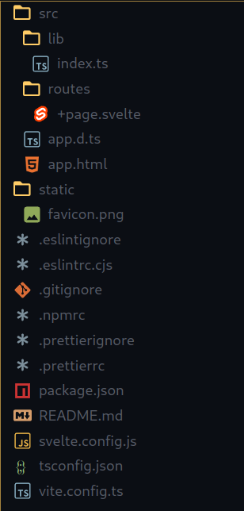

-   src - All source codes
    -   lib - library files
    -   routes - file based router
-   static - static files (images, fonts, videos...)
-   svelte.config.js - config file for SvelteKit

---

# Router

-   each file must start with +
-   type of files:
    -   +page.svelte - client side files
    -   +server.js/.ts - code run on server
    -   +layout.svelte
    -   +(page|layout).server.js/.ts - code which is run when route is accessed on server

---

# First svelte page

```Svelte
<script lang="ts">
	let counter = 0;

	const handleClick = () => {
		counter++;
	};
</script>

<span>{counter}</span>
<button on:click={handleClick}>click</button>
```

---

# First svelte page

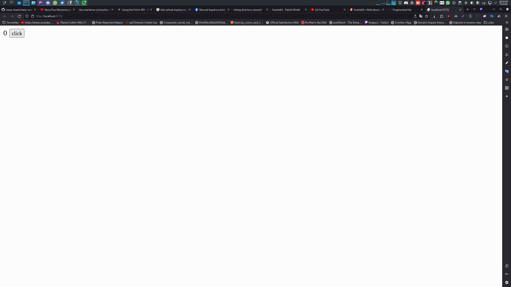

---

# Layout

+layout.svelte

```Svelte
<h2>My cool Website</h2>
<slot />
```

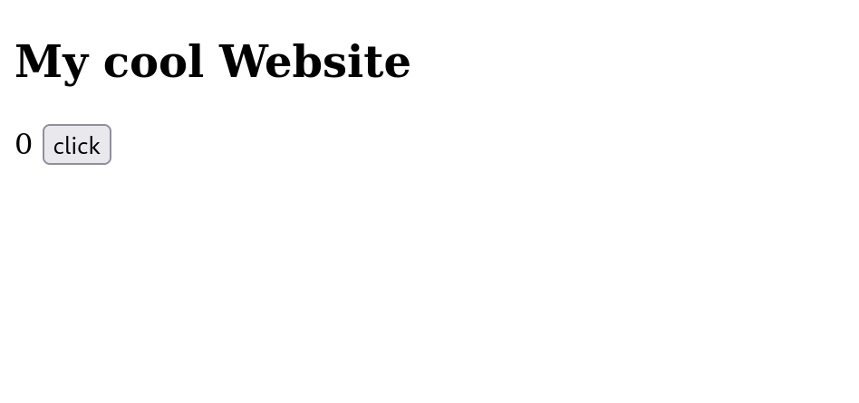

---

# More from routing

Paths:

<div style="display:flex; flex-direction:row;gap: 20px;">
  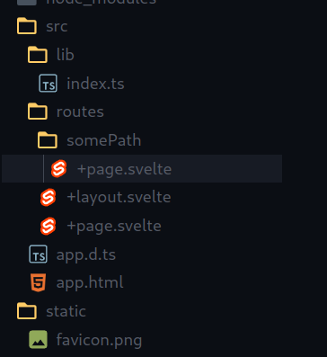
  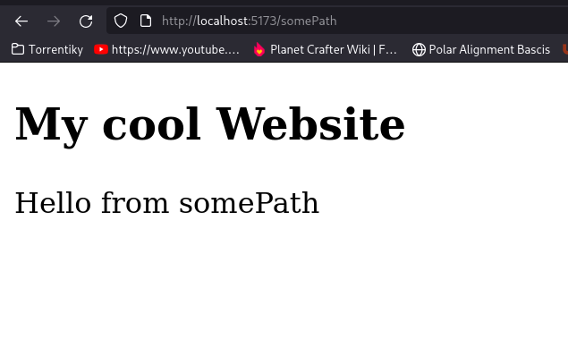
</div>

---

# More from routing

Parameters:

<div style="display:flex; flex-direction:row;gap: 20px;width:100%;align-items: stretch;">
  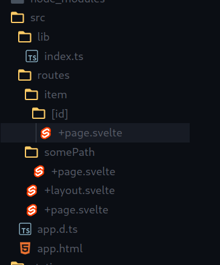
  <div style="width:100%">
  
  ```Svelte
  <script lang="ts">
  	import { page } from '$app/stores';
  </script>
  
  Item id: {$page.params.id}
  
  ```

  </div>
</div>

---

# More from routing

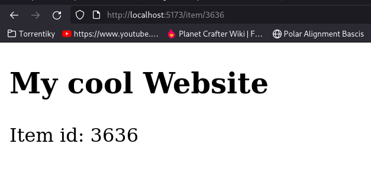

---

# Stores

-   structure to store data
-   can register listeners

```Svelte
<script lang="ts" context="module">
	import { writable } from 'svelte/store';

	export let counter = writable<number>(0);
</script>
```

---

# Stores

```Svelte
<script lang="ts">
	import { counter } from '$lib/data.svelte';

	const handleClick = () => {
		$counter++;
	};

	counter.subscribe((value) => {
		console.log(value);
	});
</script>

<span>{$counter}</span>
<button on:click={handleClick}>click</button>
<a href="/somePath">Go to somePath</a>
```

---

# Stores

```Svelte
<script lang="ts">
	import { counter } from '$lib/data.svelte';
</script>

Hello from somePath <br />
Your counter is {$counter} <br />

<a href="/">Back to counting</a>
```

---

# Stores

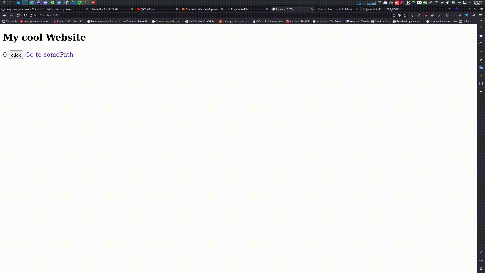

---

# Logic blocks

-   If - else
-   If - else if - else
-   Each
-   Await
-   Key

---

# Logic blocks - If

```Svelte
<script lang="ts">
	import { counter } from '$lib/data.svelte';

	const handleClick = () => {
		$counter++;
	};
</script>

<span>{$counter}</span>
<button on:click={handleClick}>click</button>
{#if $counter > 10}
	<h2>Yay! You clicked more than 10 times!</h2>
{:else if $counter > 5}
	<h2>Keep clicking!</h2>
{:else}
	<h2>You need to click more!</h2>
{/if}
```

---

# Logic blocks - If

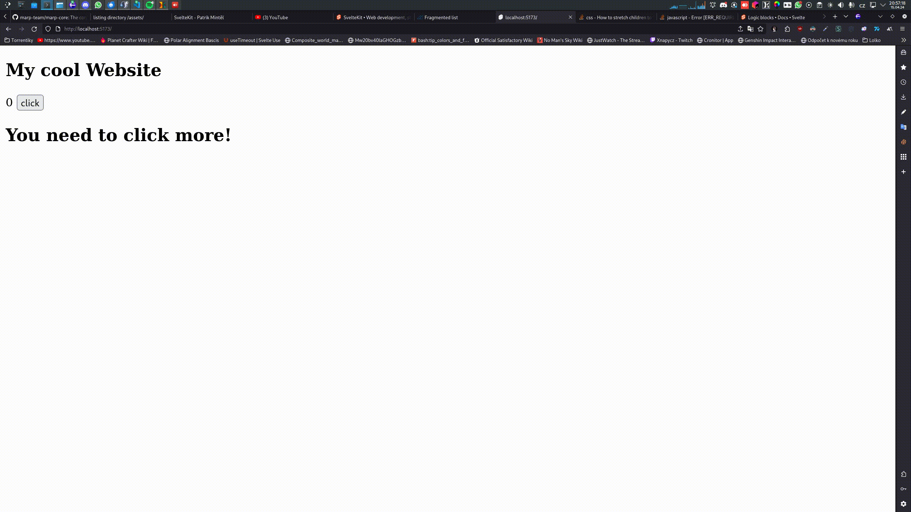

---

# Logic blocks - Each

```Svelte
<script lang="ts">
	const items = ['apple', 'banana', 'cherry'];
</script>

<h2>Shopping list:</h2>
<ul>
	{#each items as item}
		<li>{item}</li>
	{/each}
</ul>
```

---

# Logic blocks - Each

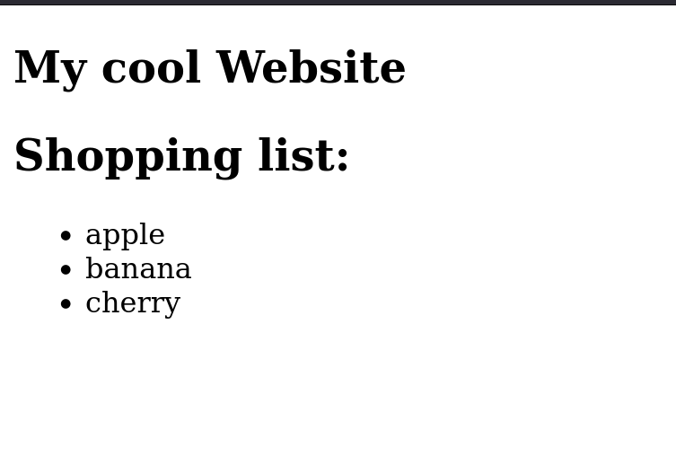

---

# Logic blocks

-   **If - else**
-   **If - else if - else**
-   **Each**
-   Await
-   Key

---

# Logic blocks - Await

```Svelte
<script lang="ts">
  const someValue = new Promise((resolve) => {
    setTimeout(resolve, 5000)
  })
</script>

{#await someValue}
  <h2>Waiting 5 seconds</h2>
{:then}
  <h2>5 Second passed</h2>
{/await}
```

---

# Logic blocks - Await

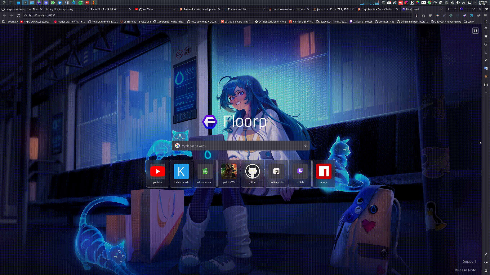

---

# Logic blocks - Key

```Svelte
{#key someValue}
  <h2>Content refreshed, each time someValue changes</h2>
{/await}
```

---

# Why SvelteKit?

-   Its compiled
-   Small learning curve
-   Can be deployed easily using adapters
-   Can be used with every library, which uses VanillaJS

---

# Adapters

-   Helps you with deploying app on specific platform
-   List of adapters:
    -   adapter-cloudflare
    -   adapter-cloudflare-workers
    -   adapter-netlify
    -   adapter-node
    -   adapter-static
    -   adapter-vercel

---

# Adapters

```JS
import adapter from '@sveltejs/adapter-node';
import { vitePreprocess } from '@sveltejs/vite-plugin-svelte';

/** @type {import('@sveltejs/kit').Config} */
const config = {
    // Consult https://kit.svelte.dev/docs/integrations#preprocessors
    // for more information about preprocessors
    preprocess: vitePreprocess(),

    kit: {
        // adapter-auto only supports some environments, see https://kit.svelte.dev/docs/adapter-auto for a list.
        // If your environment is not supported or you settled on a specific environment, switch out the adapter.
        // See https://kit.svelte.dev/docs/adapters for more information about adapters.
        adapter: adapter(),
        alias: {
            '$/*': 'src/*'
        }
    }
};

export default config;
```

---

<div style="display:flex; width: 100%; height: 100%;">
  <div style="display:flex;flex-direction: column; margin: auto; width:max-content; height:max-content;text-align:center;">

# Question time

Any questions?

  </div>
</div>

---

<div style="display:flex; width: 100%; height: 100%;">
  <div style="display:flex;flex-direction: column; margin: auto; width:max-content; height:max-content;text-align:center;">

# Thank you

Patrik Mintěl

  </div>
</div>
