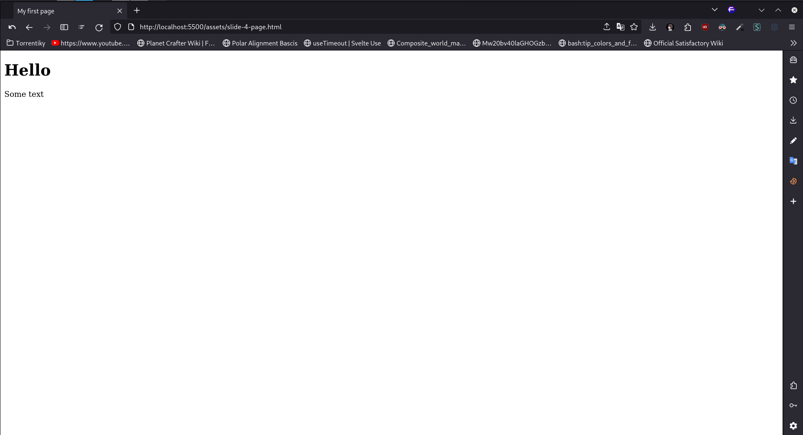
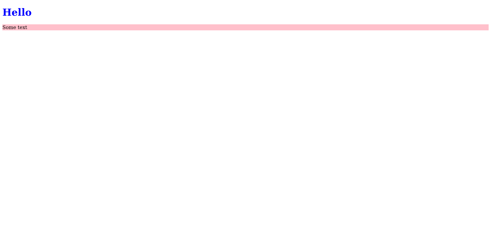
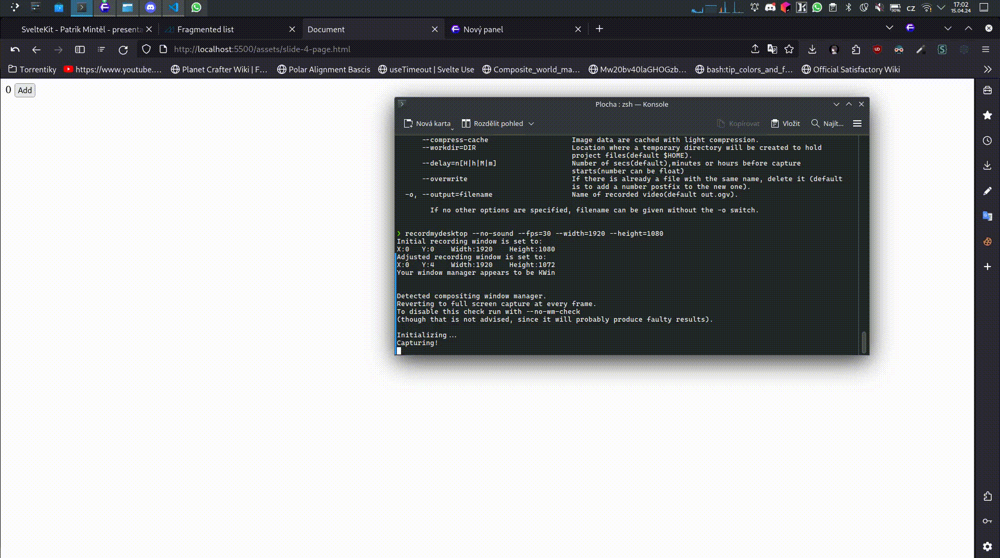

<style>
  /*!
  Theme: GitHub Dark Dimmed
  Description: Dark dimmed theme as seen on github.com
  Author: github.com
  Maintainer: @Hirse
  Updated: 2021-05-15

  Colors taken from GitHub's CSS
*/

.hljs {
  color: #adbac7;
  background: #22272e;
}

.hljs-doctag,
.hljs-keyword,
.hljs-meta .hljs-keyword,
.hljs-template-tag,
.hljs-template-variable,
.hljs-type,
.hljs-variable.language_ {
  /* prettylights-syntax-keyword */
  color: #f47067;
}

.hljs-title,
.hljs-title.class_,
.hljs-title.class_.inherited__,
.hljs-title.function_ {
  /* prettylights-syntax-entity */
  color: #dcbdfb;
}

.hljs-attr,
.hljs-attribute,
.hljs-literal,
.hljs-meta,
.hljs-number,
.hljs-operator,
.hljs-variable,
.hljs-selector-attr,
.hljs-selector-class,
.hljs-selector-id {
  /* prettylights-syntax-constant */
  color: #6cb6ff;
}

.hljs-regexp,
.hljs-string,
.hljs-meta .hljs-string {
  /* prettylights-syntax-string */
  color: #96d0ff;
}

.hljs-built_in,
.hljs-symbol {
  /* prettylights-syntax-variable */
  color: #f69d50;
}

.hljs-comment,
.hljs-code,
.hljs-formula {
  /* prettylights-syntax-comment */
  color: #768390;
}

.hljs-name,
.hljs-quote,
.hljs-selector-tag,
.hljs-selector-pseudo {
  /* prettylights-syntax-entity-tag */
  color: #8ddb8c;
}

.hljs-subst {
  /* prettylights-syntax-storage-modifier-import */
  color: #adbac7;
}

.hljs-section {
  /* prettylights-syntax-markup-heading */
  color: #316dca;
  font-weight: bold;
}

.hljs-bullet {
  /* prettylights-syntax-markup-list */
  color: #eac55f;
}

.hljs-emphasis {
  /* prettylights-syntax-markup-italic */
  color: #adbac7;
  font-style: italic;
}

.hljs-strong {
  /* prettylights-syntax-markup-bold */
  color: #adbac7;
  font-weight: bold;
}

.hljs-addition {
  /* prettylights-syntax-markup-inserted */
  color: #b4f1b4;
  background-color: #1b4721;
}

.hljs-deletion {
  /* prettylights-syntax-markup-deleted */
  color: #ffd8d3;
  background-color: #78191b;
}

.hljs-char.escape_,
.hljs-link,
.hljs-params,
.hljs-property,
.hljs-punctuation,
.hljs-tag {
  /* purposely ignored */
}

/*MY STYLE*/

h1, strong {
  color: #F96743 !important;
}
</style>


# **SvelteKit**

Frontend & Backend framework

<span style="color:#101417;">Patrik Mintěl</span>

---

# Terminology

-   Frontend
-   Backend
-   Framework
-   Router

---

# Frontend

-   HTML
-   CSS
-   JavaScript

---

# HTML

```HTML
<!DOCTYPE html>
<html lang="en">
<head>
    <meta charset="UTF-8">
    <title>My first page</title>
</head>
<body>
    <h1>Hello</h1>
    <p>Some text</p>
</body>
</html>
```

---

# HTML



---

# CSS

```CSS
h1 {
  color: blue;
}

p {
  background-color: pink;
  color: black;
}
```

---

# CSS



---

# JavaScript

```HTML
<!DOCTYPE html>
<html lang="en">
    <head>
        <meta charset="UTF-8" />
        <meta name="viewport" content="width=device-width, initial-scale=1.0" />
        <title>Document</title>
    </head>
    <body>
        <span>0</span>
        <button>Add</button>

        <script>
            let counter = 0;

            const span = document.querySelector('span');

            document.querySelector('button')?.addEventListener('click', () => {
                counter++;
                span.textContent = counter;
            });
        </script>
    </body>
</html>
```

---

# JavaScript


