# 1. První síť

Název: `web-edu`

Odkaz: https://networkrepository.com/web-edu.php

Popis: Nodes are web-pages and edges are hyperlinks between pages.

## 1.1. Základní data o síti

Síť obsahuje 3031 vrcholů, které reprezentují webové stránky. Hrany mezi vrcholy jsou reprezentovány hypertextovými odkazy mezi stránkami. Síť je neorientovaná a nevážená.

## 1.2. Základní statistiky

Obrázek sítě:

Statisticky v tabulce:

| Název vlastnosti                    | Hodnota               |
| ----------------------------------- | --------------------- |
| **Počet vrcholů**                   | 3031                  |
| **Počet hran**                      | 6474                  |
| **Průměrný stupeň**                 | 4.27185747278126      |
| **Minimální stupeň**                | 1                     |
| **Maximální stupeň**                | 104                   |
| **Hustota sítě**                    | 0.0014098539514129573 |
| **Průměrný shlukovací koeficient**  | 0.5641840121187356    |
| **Průměr nejkratších cest v grafu** | 4.273095287093869     |
| **Počet komunit**                   | 56                    |

Centrální vrcholy: 2907, 2908, 2949, 2951, 2955, 2959, 2963, 2997, 3010, 3013, 3014, 3015, 3016, 3017, 3026

## 1.3 Prvotní analýza

V sítí se nachází velké možství hubů, jedním z hlavních hůbů je vrchol číslo 2818, který má největší stupeň a pravděpodobně se jednalo o nějaký rozcestník, který měl na svojí stránce hromadů odkazů na ostatní.
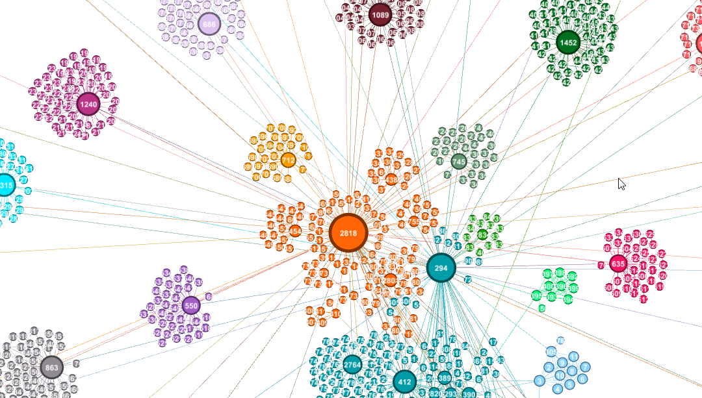

Když se podíváme z větší dálky, tak se kolem hlavního hubu nachází další menší huby (hvězdy), které tvojí s ostatními vrcholy svoje vlastní komunity.

Máme zde i několik klik, například:

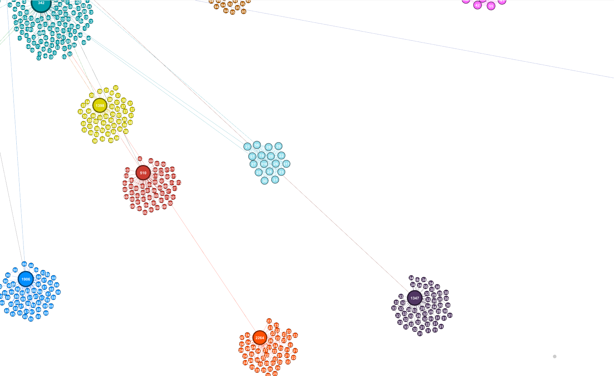
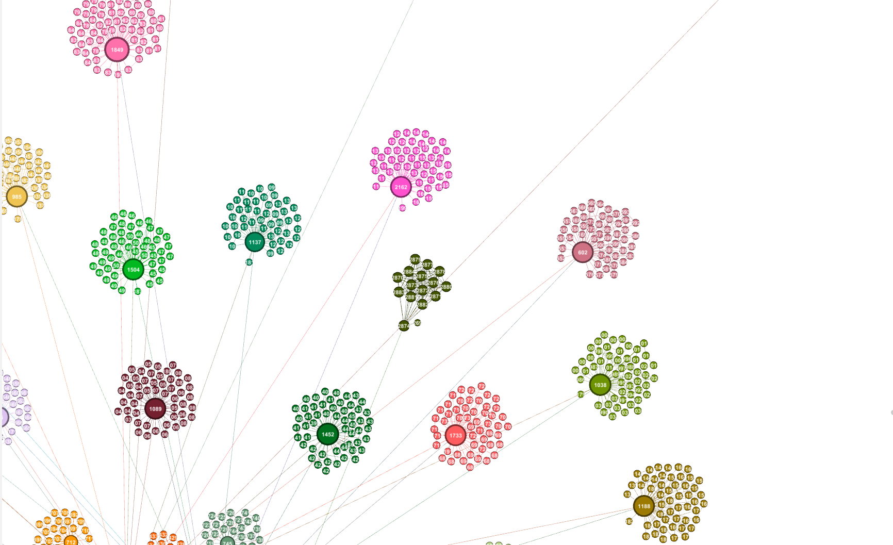

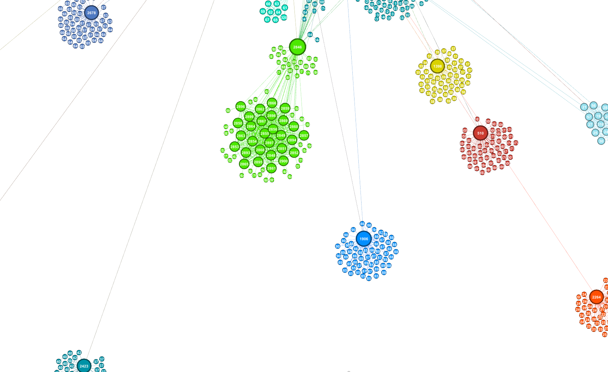

# 2. Druhá síť

Název: `Bitcoin Alpha trust weighted signed network`

Odkaz: http://snap.stanford.edu/data/soc-sign-bitcoin-alpha.html

Popis: This is who-trusts-whom network of people who trade using Bitcoin on a platform called Bitcoin Alpha. Since Bitcoin users are anonymous, there is a need to maintain a record of users' reputation to prevent transactions with fraudulent and risky users. Members of Bitcoin Alpha rate other members in a scale of -10 (total distrust) to +10 (total trust) in steps of 1. This is the first explicit weighted signed directed network available for research.

## 2.1. Základní data o síti

Síť obsahuje 3783 vrcholů, které reprezentují uživatele, kteří obchodují pomocí Bitcoinu na platformě Bitcoin Alpha. Hrany mezi vrcholy jsou reprezentovány důvěrou mezi uživateli. Síť je orientovaná a vážená. Z toho důvodu jsem síť upravil na neorientovanou a neváženou, kdy nyní hrana mezi dvěma vrcholy znamená, že se navzájem nějak důvěřují, nebo ne.

## 2.2. Data kompletí sítě:

Obrázek sítě:

| Název vlastnosti  | Hodnota |
| ----------------- | ------- |
| **Počet vrcholů** | 3783    |
| **Počet hran**    | 14124   |
| **Počet komunit** | 12      |

## 2.3. Rozdělení sítě:

Síť jsem se rozdl rozděli na 8 částí v intervalech:

| Jméno             | Interval od         | Interval do         |
| ----------------- | ------------------- | ------------------- |
| **network-0.csv** | 08.11.2010 04:00:00 | 03.07.2011 19:00:00 |
| **network-1.csv** | 03.07.2011 19:00:00 | 26.02.2012 10:00:00 |
| **network-2.csv** | 26.02.2012 10:00:00 | 21.10.2012 01:00:00 |
| **network-3.csv** | 21.10.2012 01:00:00 | 15.06.2013 16:00:00 |
| **network-4.csv** | 15.06.2013 16:00:00 | 08.02.2014 07:00:00 |
| **network-5.csv** | 08.02.2014 07:00:00 | 03.10.2014 22:00:00 |
| **network-6.csv** | 03.10.2014 22:00:00 | 29.05.2015 13:00:00 |
| **network-7.csv** | 29.05.2015 13:00:00 | 22.01.2016 04:00:00 |

## 2.4. Statistiky jednotlivých rozdělení:

### 2.4.1. network-0.csv (08.11.2010 04:00:00 - 03.07.2011 19:00:00)

Obrázek sítě:
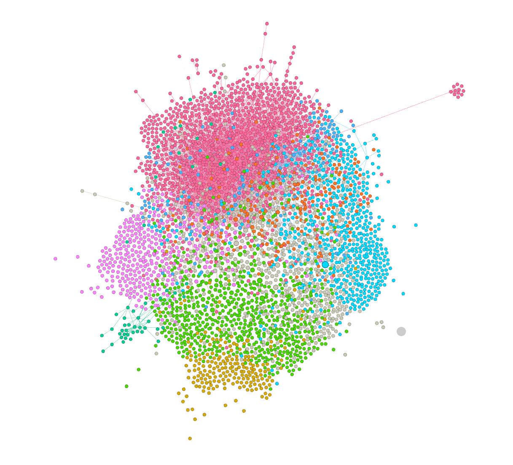

| Název vlastnosti                   | Hodnota             |
| ---------------------------------- | ------------------- |
| **Počet vrcholů**                  | 1208                |
| **Počet hran**                     | 3045                |
| **Průměrný stupeň**                | 5.041390728476821   |
| **Minimální stupeň**               | 1                   |
| **Maximální stupeň**               | 161                 |
| **Hustota sítě**                   | 0.0041767943069402  |
| **Průměrný shlukovací koeficient** | 0.10144217859220399 |

### 2.4.2. network-1.csv (03.07.2011 19:00:00 - 26.02.2012 10:00:00)

Obrázek sítě:
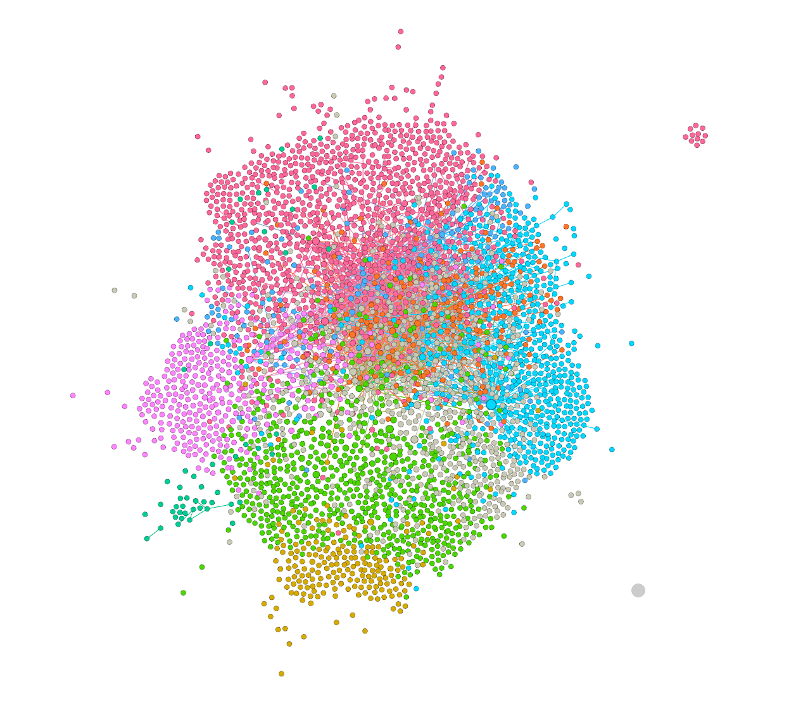

| Název vlastnosti                   | Hodnota             |
| ---------------------------------- | ------------------- |
| **Počet vrcholů**                  | 797                 |
| **Počet hran**                     | 1807                |
| **Průměrný stupeň**                | 4.534504391468005   |
| **Minimální stupeň**               | 1                   |
| **Maximální stupeň**               | 131                 |
| **Hustota sítě**                   | 0.00569661355712061 |
| **Průměrný shlukovací koeficient** | 0.11229915899510384 |

### 2.4.3. network-2.csv (26.02.2012 10:00:00 - 21.10.2012 01:00:00)

Obrázek sítě:
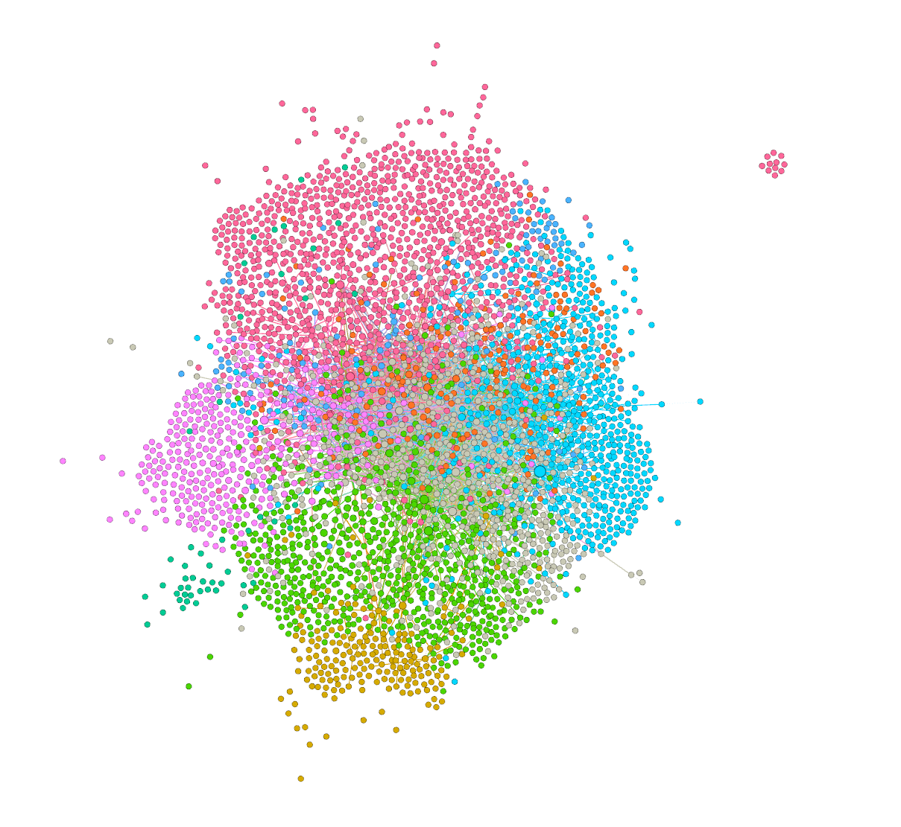

| Název vlastnosti                   | Hodnota              |
| ---------------------------------- | -------------------- |
| **Počet vrcholů**                  | 1003                 |
| **Počet hran**                     | 2970                 |
| **Průměrný stupeň**                | 5.922233300099701    |
| **Minimální stupeň**               | 1                    |
| **Maximální stupeň**               | 120                  |
| **Hustota sítě**                   | 0.005910412475149402 |
| **Průměrný shlukovací koeficient** | 0.12352084937270204  |

### 2.4.4. network-3.csv (21.10.2012 01:00:00 - 15.06.2013 16:00:00)

Obrazek sítě:
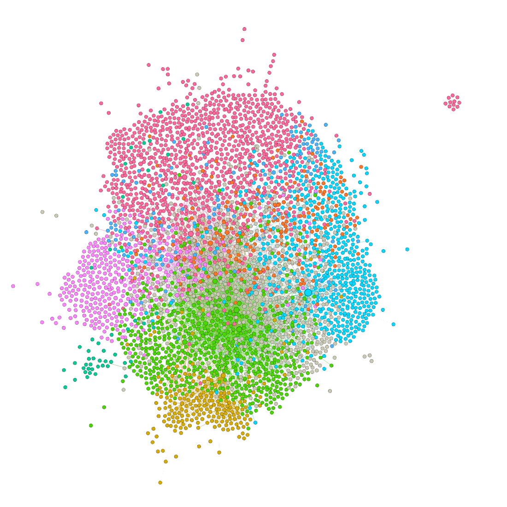

| Název vlastnosti                   | Hodnota              |
| ---------------------------------- | -------------------- |
| **Počet vrcholů**                  | 1223                 |
| **Počet hran**                     | 3104                 |
| **Průměrný stupeň**                | 5.076042518397384    |
| **Minimální stupeň**               | 1                    |
| **Maximální stupeň**               | 217                  |
| **Hustota sítě**                   | 0.004153880947952032 |
| **Průměrný shlukovací koeficient** | 0.14219719465713856  |

### 2.4.5. network-4.csv (15.06.2013 16:00:00 - 08.02.2014 07:00:00)

Obrázek sítě:
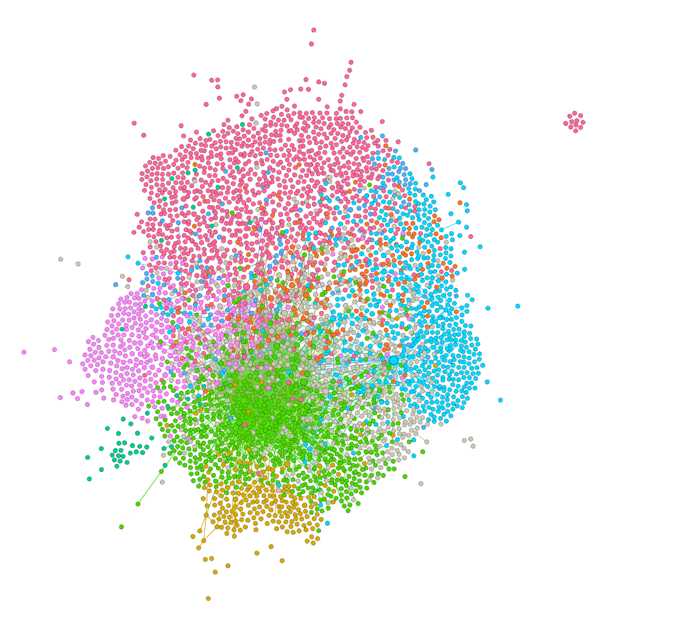

| Název vlastnosti                   | Hodnota              |
| ---------------------------------- | -------------------- |
| **Počet vrcholů**                  | 802                  |
| **Počet hran**                     | 1837                 |
| **Průměrný stupeň**                | 4.581047381546135    |
| **Minimální stupeň**               | 1                    |
| **Maximální stupeň**               | 123                  |
| **Hustota sítě**                   | 0.005719160276586935 |
| **Průměrný shlukovací koeficient** | 0.12600775461163757  |

### 2.4.6. network-5.csv (08.02.2014 07:00:00 - 03.10.2014 22:00:00)

Obrázek sítě:
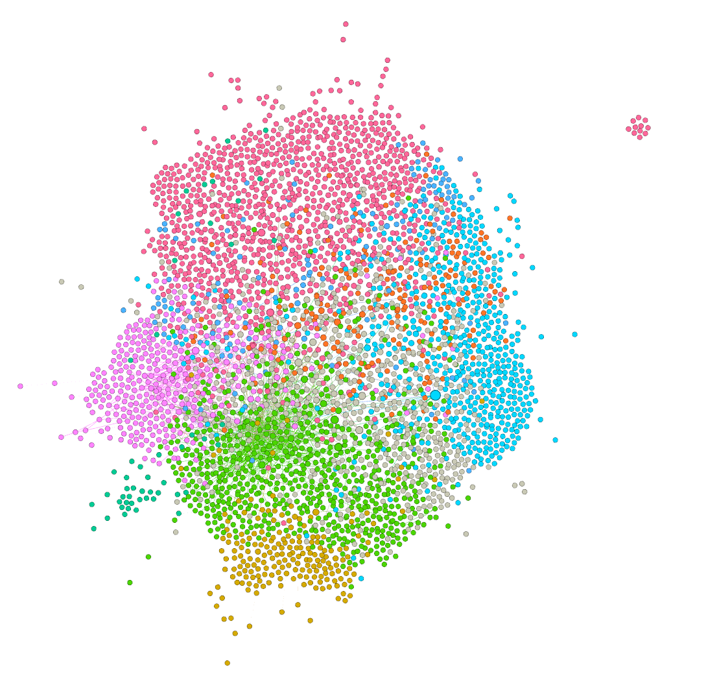

| Název vlastnosti                   | Hodnota              |
| ---------------------------------- | -------------------- |
| **Počet vrcholů**                  | 586                  |
| **Počet hran**                     | 1382                 |
| **Průměrný stupeň**                | 4.716723549488054    |
| **Minimální stupeň**               | 1                    |
| **Maximální stupeň**               | 103                  |
| **Hustota sítě**                   | 0.008062775298270179 |
| **Průměrný shlukovací koeficient** | 0.12998947249628964  |

### 2.4.7. network-6.csv (03.10.2014 22:00:00 - 29.05.2015 13:00:00)

Obrázek sítě:
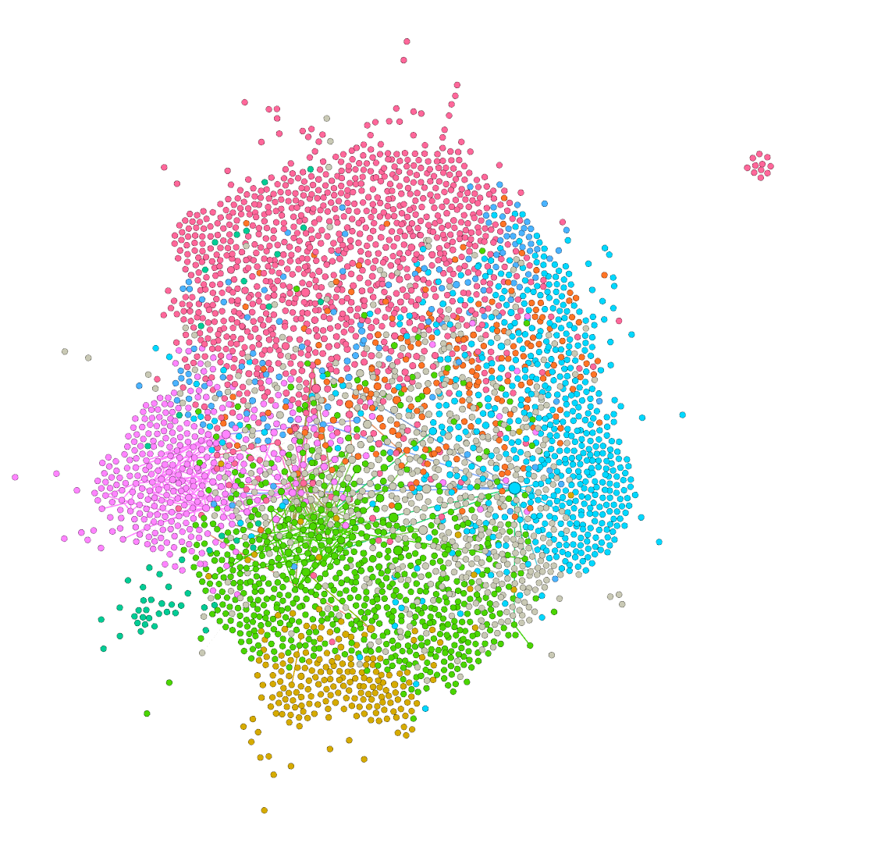

| Název vlastnosti                   | Hodnota            |
| ---------------------------------- | ------------------ |
| **Počet vrcholů**                  | 245                |
| **Počet hran**                     | 493                |
| **Průměrný stupeň**                | 4.024489795918368  |
| **Minimální stupeň**               | 1                  |
| **Maximální stupeň**               | 62                 |
| **Hustota sítě**                   | 0.0164938106390097 |
| **Průměrný shlukovací koeficient** | 0.1420682999794377 |

### 2.4.8. network-7.csv (29.05.2015 13:00:00 - 22.01.2016 04:00:00)

Obrázek sítě:
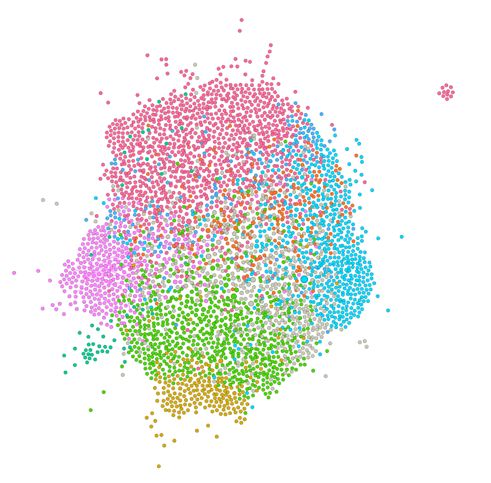

| Název vlastnosti                   | Hodnota            |
| ---------------------------------- | ------------------ |
| **Počet vrcholů**                  | 100                |
| **Počet hran**                     | 166                |
| **Průměrný stupeň**                | 3.32               |
| **Minimální stupeň**               | 1                  |
| **Maximální stupeň**               | 37                 |
| **Hustota sítě**                   | 0.0335353535353535 |
| **Průměrný shlukovací koeficient** | 0.0796047494073809 |

## 2.5. Prvotní analýza

Když se na síť podíváme, vrchol s nejvíce hranami je vrchol 1, tedy jedná s o uživatele, který ma s nejvíce lidma důvěru, nebo naopak. Největší komunita je tady poté růžovo-červená.

Pak zde máme pár osamocených komunit vždy dvou lidí:

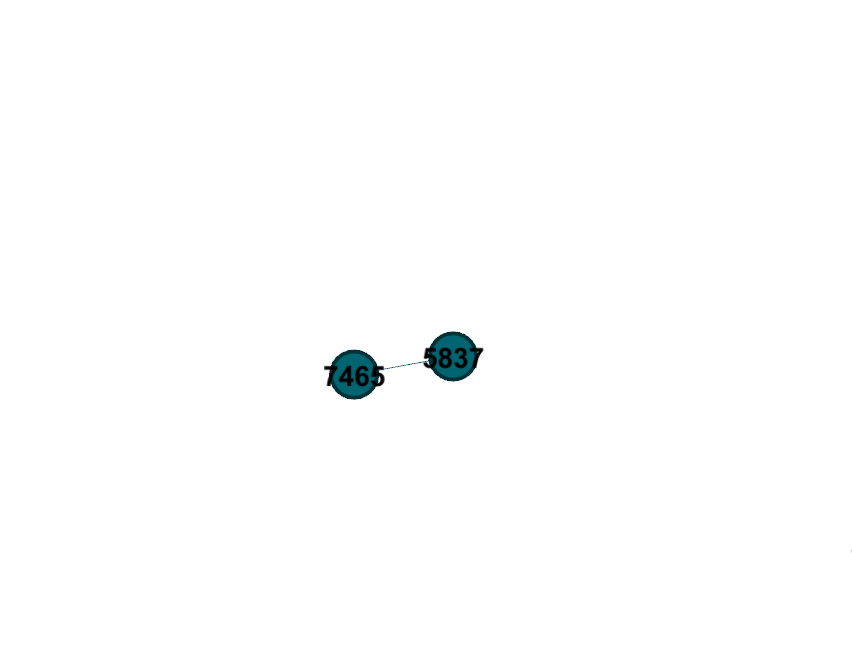
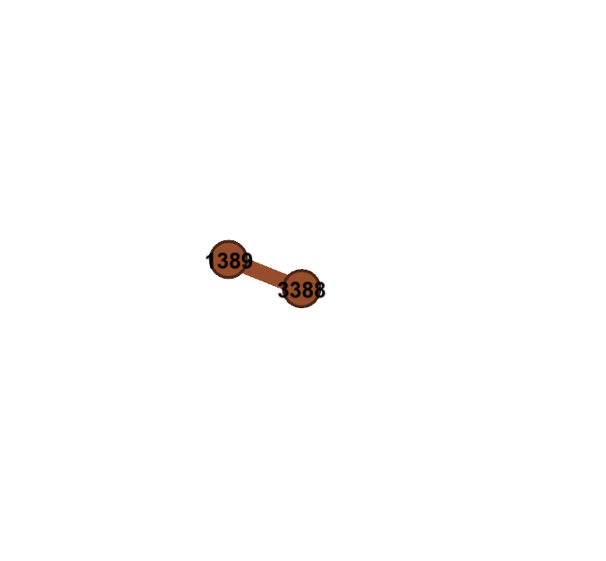
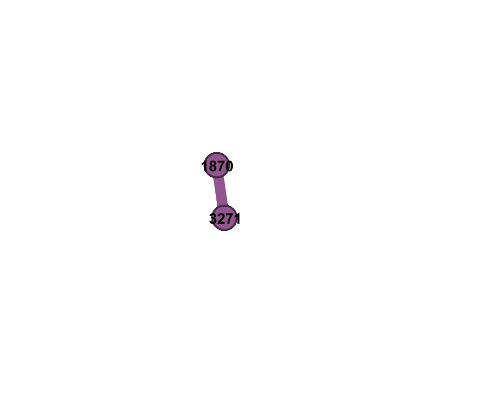
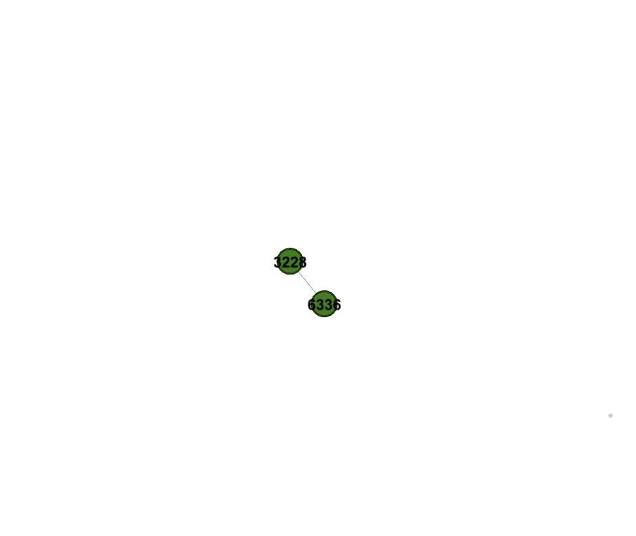

## 2.6. Analýza rozdělení

Nejvíce hran se nachází v rozdělené čási číslo 4, která je od 21.10.2012 01:00:00 do 15.06.2013 16:00:00 a obsahuje 3104 hran. Nejméně hran se nachází v rozdělené čási číslo 7, která je od 29.05.2015 13:00:00 do 22.01.2016 04:00:00 a obsahuje 166 hran.

Největší průměrný stupeň se ale nachází v rozdělené čási číslo 3, přestože největší maximální stupeň se nachází v rozdělené čási číslo 4 s hodnout 217.
