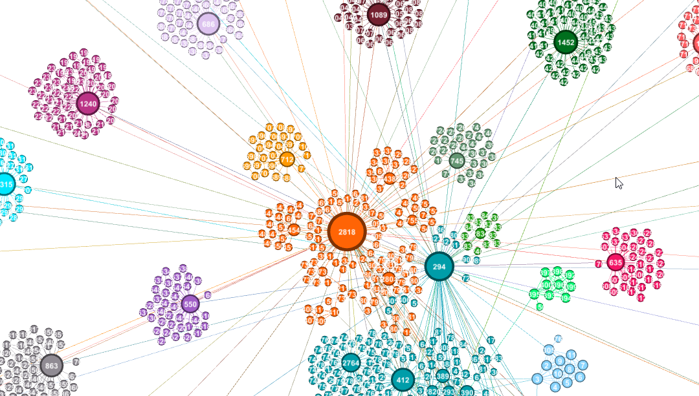
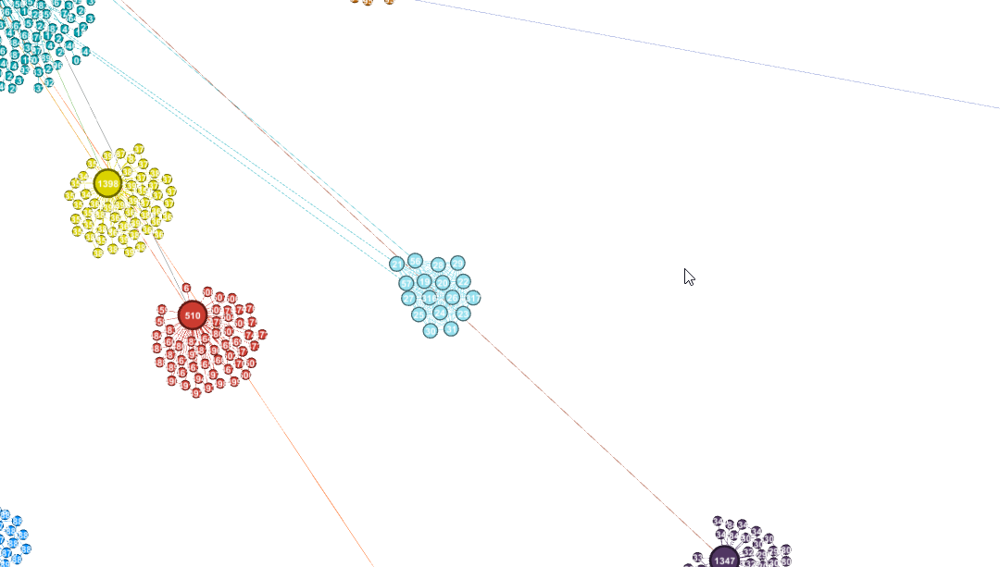
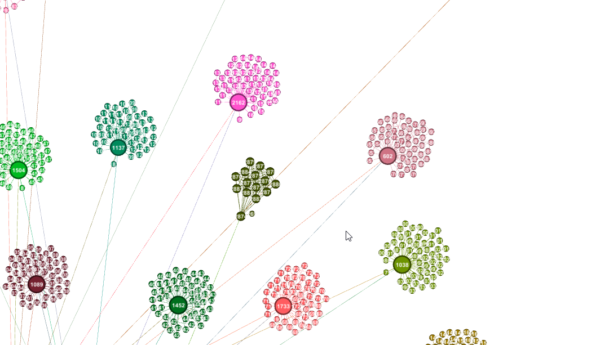
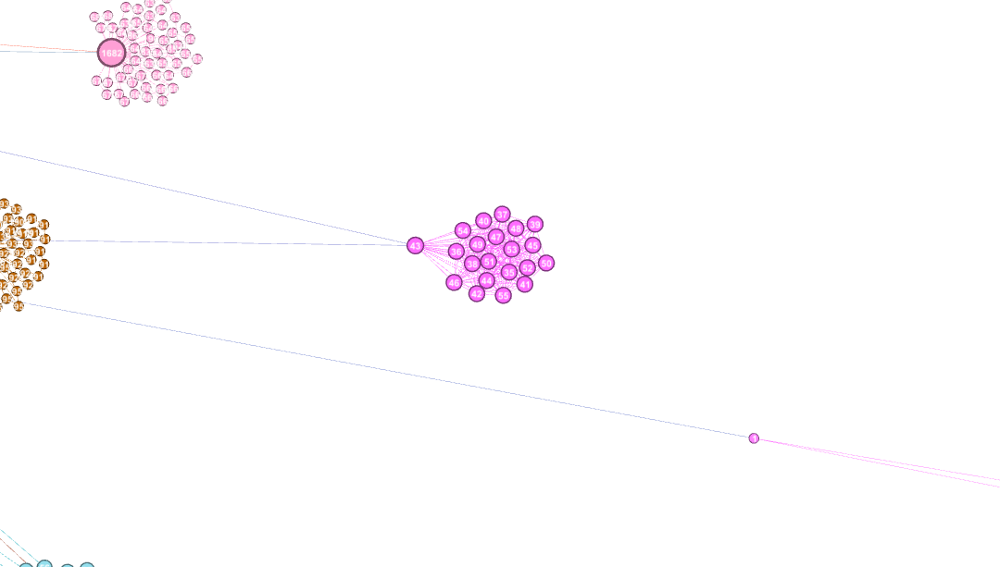

# 1. První síť

Název: `web-edu`
Odkaz: https://networkrepository.com/web-edu.php
Popis: Nodes are web-pages and edges are hyperlinks between pages.

Sit ma 3031 vrcholu a 6474 hran.
Prumerny stupen je 4.27185747278126, min. stupen je 1 a max. stupen je 104
Hustota site je 0.0014098539514129573
Prumerny shlukovaci koeficient je 0.5641840121187356
Průměr nejkratších cest v grafu 4.273095287093869
Centrální vrcholy: ['3014', '3015', '2908', '2907', '2951', '2959', '2963', '3013', '3016', '3017', '3026', '2949', '2955', '2997', '3010']

## 1.1. Základní data o síti

Síť obsahuje 3031 vrcholů, které reprezentují webové stránky. Hrany mezi vrcholy jsou reprezentovány hypertextovými odkazy mezi stránkami. Síť je neorientovaná a nevážená.

#### Obrázek sítě:

## 1.2. Základní statistiky

Statisticky v tabulce:

| Název vlastnosti                    | Hodnota               |
| ----------------------------------- | --------------------- |
| **Počet vrcholů**                   | 3031                  |
| **Počet hran**                      | 6474                  |
| **Průměrný stupeň**                 | 4.27185747278126      |
| **Minimální stupeň**                | 1                     |
| **Maximální stupeň**                | 104                   |
| **Hustota sítě**                    | 0.0014098539514129573 |
| **Průměrný shlukovací koeficient**  | 0.5641840121187356    |
| **Průměr nejkratších cest v grafu** | 4.273095287093869     |

Centrální vrcholy: 2907, 2908, 2949, 2951, 2955, 2959, 2963, 2997, 3010, 3013, 3014, 3015, 3016, 3017, 3026

# 1.3 Prvotní analýza

V sítí se nachází velké možství hubů, jedním z hlavních hůbů je vrchol číslo 2818, který má největší stupeň a pravděpodobně se jednalo o nějaký rozcestník, který měl na svojí stránce hromadů odkazů na ostatní.

Když se podíváme z větší dálky, tak se kolem hlavního hubu nachází další menší huby (hvězdy), které tvojí s ostatními vrcholy svoje vlastní komunity.

Máme zde i několik klik, například:

